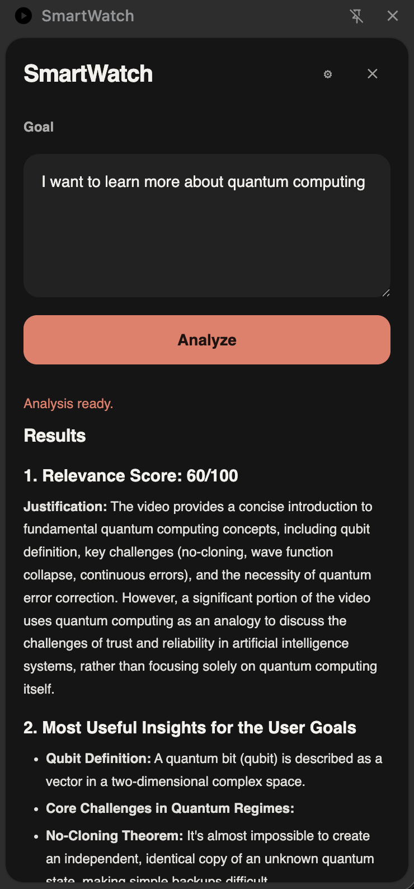
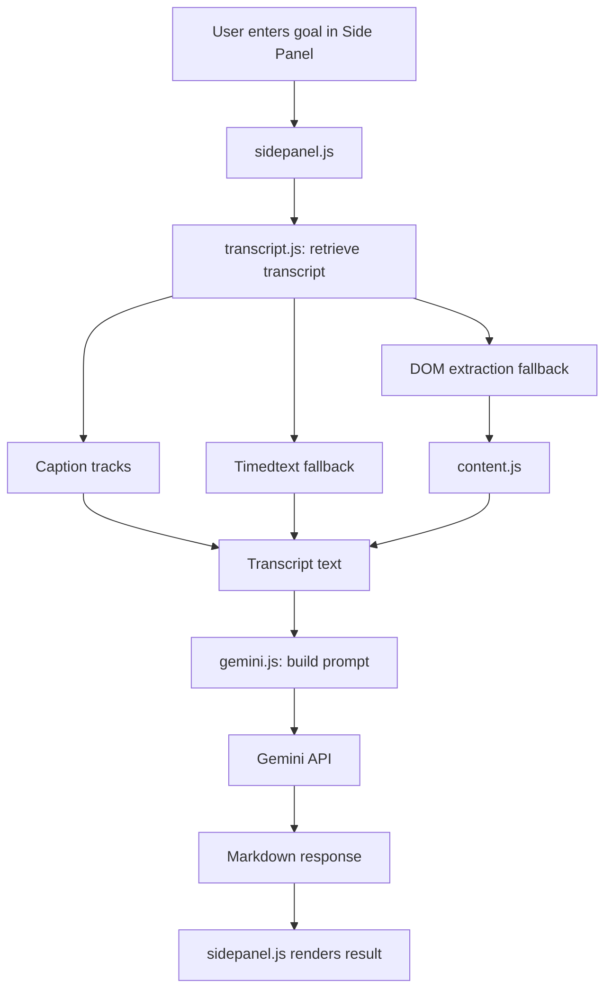

# SmartWatch



SmartWatch is a minimal Chrome extension for YouTube that:
- fetches a video transcript,
- evaluates it against a user-defined goal,
- returns a concise Gemini-powered analysis in the side panel.

I use this extension myself, so the project is still evolving in practical ways.
For the time being, I may continue updating transcript fallbacks, fixing errors, and improving reliability as YouTube and model behavior change.

## Architecture Overview

| File | Function |
| --- | --- |
| `manifest.json` | Declares permissions, extension entry points, side panel, content script, and background service worker. |
| `background.js` | Enables the side panel on YouTube watch pages and keeps that state synchronized across startup, navigation, and tab activation. |
| `content.js` | Reads the active YouTube video context and performs DOM-based transcript extraction as the final fallback. |
| `sidepanel.html` | Defines the side panel UI structure for goals, results, settings, and advanced options. |
| `sidepanel.js` | Manages UI state, saved settings, analyze flow, validation, status messages, and Markdown rendering. |
| `styles.css` | Defines the visual system and layout for the side panel. |
| `transcript.js` | Retrieves transcripts through caption tracks first, then timedtext fallback, then page-context fallback logic. |
| `gemini.js` | Builds the final prompt, calls Gemini, and maps API errors into shorter user-facing messages. |
| `PRIVACY.md` | Documents the current data handling and permission usage of the repository. |

## Requirements

- Google Chrome with Manifest V3 support
- Gemini API key from Google AI Studio

## Why Gemini

This project uses Gemini for a few practical reasons:

- it is accessible for students through Google AI Studio and often comes with a generous free tier,
- it is easy to test and iterate with using a personal API key,
- in practice, it has felt particularly good at summarizing long YouTube transcripts and turning them into structured takeaways.

## Installation

1. Open `chrome://extensions`.
2. Enable `Developer mode`.
3. Click `Load unpacked`.
4. Select the project folder.

More details: [Chrome Extensions Documentation](https://developer.chrome.com/docs/extensions)

## Usage

1. Open a YouTube watch page.
2. Open the SmartWatch side panel from the extension action.
3. Open `Settings`.
4. Paste your `Gemini API Key` and click `Save settings`.
5. Optionally open `Advanced`, pick a Gemini model preset, or choose `Custom` and enter a model string manually.
6. Enter or edit your goal in the main view.
7. Click `Analyze`.
8. Read the result in `Results`.

## Analysis Flow

1. User enters a goal in the side panel.
2. `sidepanel.js` detects the current YouTube video.
3. `transcript.js` tries caption tracks first.
4. If needed, `transcript.js` tries the timedtext fallback.
5. If needed, DOM extraction fallback is used through `content.js`.
6. If the transcript is too long, `gemini.js` compacts it before sending it to the model.
7. Transcript + goal are sent to Gemini (`gemini.js`).
8. Gemini response is rendered as Markdown in the side panel.

## System Flow



## Data Handling

- The Gemini API key is stored locally in `chrome.storage.local`.
- The selected Gemini model configuration is stored locally in `chrome.storage.local`.
- The saved goal text is stored locally in `chrome.storage.local`.
- During analysis, the current goal and the retrieved transcript are sent to the Gemini API.
- The extension does not send data to any backend because there is no project-owned server in this repository.

See `PRIVACY.md` for the repository privacy note.

## Disclaimer

- You are responsible for the prompts, goals, API key, custom templates, model settings, and any other input sent through the extension.
- You are also responsible for reviewing and using the model output. The project author does not take accountability for generated content, decisions made from it, or downstream use of the response.
- Model output may be inaccurate, incomplete, biased, or misleading. No warranty or guarantee is provided for correctness, fitness, or usefulness.
- This tool is not legal, medical, financial, compliance, or other professional advice, and it should not be used as the sole basis for high-stakes or safety-critical decisions.
- Do not submit secrets, confidential business data, or sensitive personal information unless you accept the risk of sending that content to Gemini.
- Use of Gemini through this extension is also subject to Google’s terms and privacy policies.
- You are responsible for ensuring that your use of YouTube content, transcripts, and generated outputs complies with applicable laws, platform terms, and any relevant rights or permissions.

## Acceptable Use / Not for High-Risk Use

- Do not use this project for illegal activity, harassment, exploitation, disinformation, privacy violations, or other harmful conduct.
- Do not rely on this project in high-risk contexts such as medical, legal, financial, employment, compliance, safety-critical, or emergency-response decisions.
- If you choose to use or modify this project, you are responsible for how it is applied and for validating outputs before acting on them.

## Advanced Settings

Advanced Settings let you:

- choose a model preset or enter a custom Gemini model string,
- define a custom prompt template for the final analysis.

The custom prompt template supports these placeholders:

- `${goals}`
- `${transcript}`

Custom prompt templates are validated before saving and before analysis.

Current safeguards:

- both `${goals}` and `${transcript}` are required,
- very short templates are rejected,
- templates with too little instruction text beyond the placeholders are rejected.

For long videos, SmartWatch also compacts the transcript before sending it to Gemini by selecting the most relevant transcript chunks and keeping the prompt within a safer size budget.

Current default prompt template:

```text
You are analyzing a YouTube video transcript in relation to user goals.

User goals:
${goals}

Video transcript:
${transcript}

Explain:
1. Relevance score (0-100) and short justification
2. Most useful insights for the user goals
3. Actionable next steps
4. Risks, caveats, or blind spots

Keep the answer concise but complete. Use clear section headings.
```

## Limitations

Known limitations and failure modes:

- Videos without accessible captions or transcript data will fail analysis.
- Some videos may expose caption metadata but still return empty or unusable transcript payloads.
- YouTube markup changes can break the DOM extraction fallback in `content.js`.
- Changes to YouTube caption endpoints can break track-based or timedtext-based transcript retrieval.
- Non-watch YouTube pages are unsupported. The extension only analyzes `https://www.youtube.com/watch?...` pages.
- Invalid Gemini API keys return an authentication error and analysis will not start.
- Gemini quota exhaustion or rate limiting will block analysis until quota is available again.
- Custom model strings may fail if the selected model name is unavailable or unsupported by the API.
- Custom prompt templates can reduce output quality if placeholders are omitted or instructions are too vague.
- The extension currently prefers English tracks before other available languages, which may not match the spoken language of the video.
- Very short, noisy, or auto-generated transcript fragments may be rejected as unusable content.
